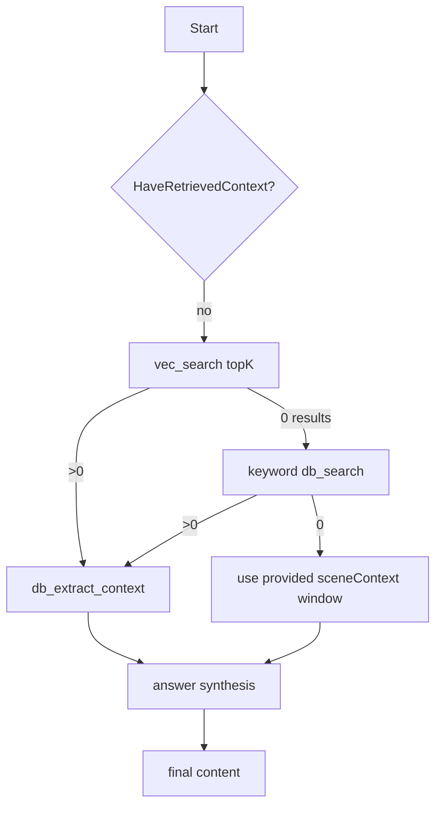
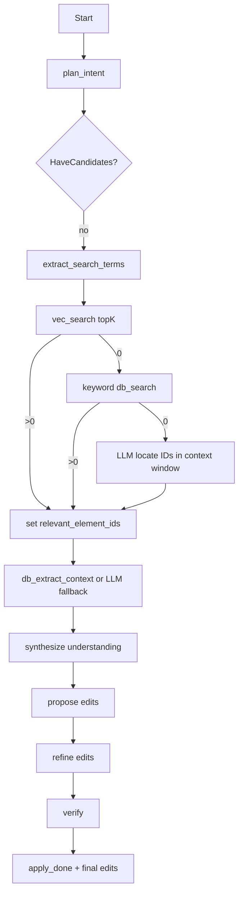

# Ask + Edit Loops (ai-service)

This document explains how the **ask** and **edit** “agentic loops” work in the Python `ai-service`, including retrieval, fallbacks, and what the frontend can render from the streaming events.

## Where to look in code

- **Entrypoint / streaming orchestration**: `server-python/services/llm_service.py`
- **Ask loop**: `server-python/services/ask_loop.py`
- **Edit loop**: `server-python/services/edit_loop.py`
- **Streaming formatting (typed vs legacy)**: `server-python/services/streaming.py`
- **DB access**: `server-python/services/db_service.py`
- **Vector retrieval (pgvector)**: `server-python/services/embedding_service.py`

## Key concepts

- **State machine**: each loop keeps an explicit `State` dataclass and advances through steps until a stopping condition is met.
- **Budgets**: each loop has hard limits (max iterations / attempts) so it can’t spin indefinitely.
- **Global Index (optional)**: the client can send a compact global index (scene list + character list) via `globalIndex`.
  - The loops use it for **query rewriting**, **reranking**, **grounding checks**, and **edit verification**.
  - It is *not* treated as primary evidence; retrieved element context remains primary.
- **Retrieval**:
  - Prefer **pgvector semantic search** (top-k element IDs) when available.
  - Fall back to **keyword DB search** (`ILIKE` search).
  - Fall back to the **bounded `sceneContext` window** (or an LLM “locate IDs in this window” approach) when DB is missing or returns nothing.
- **Streaming**:
  - When `streamEvents=true`: the server emits **typed JSON events** (status/decision/tool_call/etc.).
  - When `streamEvents=false`: the server emits **plain text progress** lines plus a **single final JSON payload** for legacy clients.

## Streaming event model (what the UI can render)

Typed events are formatted in `server-python/services/streaming.py`:

- `status`: `{"type":"status","message":"..."}`
- `decision`: `{"type":"decision","action":"...","why":"..."}`
- `tool_call`: `{"type":"tool_call","tool":"vec_search|db_search|db_extract_context", ...}`
- `tool_result`: `{"type":"tool_result","tool":"...", ...}`
- `apply_started`: `{"type":"apply_started","label":"Edit Dialogue","elementIds":[...]}`
- `apply_done`: `{"type":"apply_done"}`
- `final`:
  - ask: `{"type":"final","content":"..."}`
  - edit: `{"type":"final","edits":{"edits":[...]}}`

Legacy mode (`streamEvents=false`) emits only readable progress text lines (status-like + apply markers) and then a final raw `{"edits":[...]}` object.

## Ask loop (conceptual)

The ask loop is designed for “Cursor-like” conversational answering while staying grounded in screenplay context.

### Flow (Cursor-like)

### What it actually does (current)

Implementation: `server-python/services/ask_loop.py`

1. **Start**: emits `[Start] Answering`.\n+2. **Retrieve (bounded attempts)**:\n+   - **Rewrite queries** (3–8 variants) for recall.\n+   - Runs `vec_search` for each query variant and dedupes candidate element IDs.\n+   - If vector returns nothing, falls back to `db_search` keyword retrieval.\n+   - If candidates exist and `ASK_RERANK_ENABLED` is on:\n+     - fetches candidate snippets\n+     - runs an **LLM reranker** to select the best evidence IDs\n+   - Builds the final evidence context window via `db_extract_context`.\n+   - If `ASK_GROUNDING_GATE` is on: runs a **grounding check**; if not grounded, broadens and retries.\n+   - If no DB retrieval worked, falls back to the request’s `sceneContext`.
3. **Answer**:
   - Uses `ask_agent` with `ChatDeps(scene_context=<retrieved>)`.
   - Emits `[Writing] Drafting response`.
4. **Stop**: returns final answer text.

### Budgets

`AskLoopBudgets`:
- `max_iterations` (default 12)
- `max_retrieve_attempts` (default 2; second attempt “broadens” retrieval)

The current implementation usually completes in 1–2 iterations (retrieve once, answer once).

## Edit loop (conceptual)

The edit loop is a router→action→observe workflow that produces structured edits and emits UI-friendly progress events (including apply markers).

### Flow

### What it actually does (current)

Implementation: `server-python/services/edit_loop.py`

1. **Plan intent**:
   - Uses `plan_intent_agent` to translate the user request into an actionable intent.
   - Emits a `[Planning] ...` status line.
2. **Locate candidates**:
   - Uses `extract_search_terms_agent` to derive search terms.
   - Tries **vector retrieval** (`vec_search`) first; falls back to keyword DB search.
   - If still no candidates, uses an **LLM locate fallback** inside the bounded `scene_context` window:
     - asks for element IDs that appear in the window
     - extracts UUIDs via regex
     - last resort: uses `context_element_ids` provided by the client (if present)
3. **Load context**:
   - Prefer `db_extract_context` around the chosen IDs.
   - If DB extraction fails, use `load_context_agent` as an LLM fallback.
4. **Synthesize**:
   - Produces a “what needs to change” understanding.
5. **Propose edits**:
   - Produces an `EditResponse`-like structure (normalized by `_coerce_edit_response`).
6. **Refine edits (apply phase)**:
   - Emits `apply_started` to drive the “Edit Dialogue” pill/spinner.
   - Uses `apply_edits_agent` (and validation) to refine and normalize edits.
7. **Verify (structured)**:\n+   - Performs basic checks (IDs present, non-empty content, DB ID validation when possible).\n+   - If `EDIT_VERIFY_RECOVER` is on: runs a **structured verifier** that returns `{ok, issues, suggested_recovery}`.\n+   - If verification fails, the loop runs a **recovery playbook** (only on failure):\n+     - `relocate`: redo candidate location with broadened retrieval\n+     - `reload_context`: re-extract a larger context window\n+     - `revise_edits`: run a targeted revise pass using verifier issues\n+     - `abort`: stop safely with no edits\n+8. **Stop**:\n+   - Emits `apply_done`.\n+   - Returns final edits payload.

### Budgets

`EditLoopBudgets`:
- `max_iterations` (default 20)
- `max_locate_attempts` (default 3; later attempts broaden)
- `max_refine_attempts` (default 2)
- `max_verify_attempts` (default 2)

Conceptually the loop **can** iterate multiple times (e.g., re-locate, re-refine, re-verify) until it meets the “ready to finish” conditions or hits a budget.

## How vector retrieval fits in

- Embeddings are stored per screenplay element in Postgres (`project_element_embeddings`).
- Vector retrieval returns the top-k most similar elements for a query, optionally filtered by types (dialogue, character, action, scene-heading).
- Ask/edit loops convert those IDs into a **small context window** via `db_extract_context` so the LLM stays grounded and token usage stays bounded.

## Typed vs legacy streaming (why both exist)

The frontend originally expected a single JSON object at the end of the stream (for edit mode). Typed events stream multiple JSON objects, which broke naive `JSON.parse` logic in older clients.

The solution is:
- `streamEvents=true`: **typed JSON events** + `final` wrapper
- `streamEvents=false`: **plain text** progress + **one final raw JSON** object

## Feature flags
- `ASK_RERANK_ENABLED` (default: true): enable LLM reranking in ask retrieval.
- `ASK_GROUNDING_GATE` (default: true): enable grounding gate before answering.
- `EDIT_VERIFY_RECOVER` (default: true): enable structured verification + recovery (only on verify failure).

This preserves backward compatibility while enabling rich UI (ephemeral steps, “Edit Dialogue” pill, etc.).

## Client Global Index (globalIndex)
The client may send `globalIndex` as a compact string. Recommended format:

- `Global Index v1`
- `Scenes:` numbered scene headings with `(sceneId=...)`
- `Characters:` top characters with approximate dialogue-line counts

This should stay small (1–3 KB) and update automatically as screenplay elements change.

